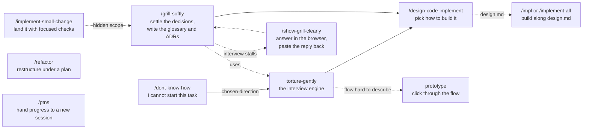

# GUOJIE-HONG Skills

**English** | [繁體中文](./README.zh-TW.md)

Agent skills for the stage *before* code is written and the first steps into it: finding a direction when you cannot start, interviewing along evidenced branches, choosing an implementation direction, implementing along it, landing small changes and refactors with proportionate validation, and handing progress to a new session.

They are built on top of [Matt Pocock's skills](https://github.com/mattpocock/skills) and extend that set rather than replace it; many of them call his skills directly.

Every skill follows one rule: **evidence, never guesswork**. Claims carry a locator (`path:line`, URL, document section, or a user statement), and anything not established is reported as unknown.

## Prerequisite

Install [mattpocock-skills](https://github.com/mattpocock/skills) before this set. The skills here that call his will not run without it.

## Install

Pick **one** route. Installing both leaves you with every skill twice.

### Claude Code plugin

This repo is its own single-plugin marketplace. It is not listed in Claude Code's official marketplace, so add the marketplace once, then install:

```text
/plugin marketplace add GUOJIE-HONG/skills
/plugin install guojie-skills@guojie-hong
```

From the terminal:

```bash
claude plugin marketplace add GUOJIE-HONG/skills
claude plugin install guojie-skills@guojie-hong
```

The plugin is a managed, read-only bundle. Pull new releases with:

```bash
claude plugin update guojie-skills@guojie-hong
```

### skills.sh (Claude Code, Codex, and other agents)

[skills.sh](https://skills.sh) copies the skill files into your project or home directory as ordinary files you own and can edit:

```bash
npx skills@latest add GUOJIE-HONG/skills
```

The installer lists every skill under the heading **Guojie Skills**. Take the ones you want, or one by name:

```bash
npx skills@latest add GUOJIE-HONG/skills --skill grill-softly
```

Nothing updates behind your back. Pull the latest with `npx skills update`.

## How the skills fit together



Every skill here is **user-invoked**: you type it, it orchestrates. The one exception is `torture-gently`, which is **model-invoked**: the agent may reach for it on its own when you ask to stress-test a plan, and `dont-know-how` and `grill-softly` call it as their interview engine.

You do not have to run the whole chain. Each skill accepts its input in whatever form it arrives (a file, a hand-off from the previous skill, or prose in the conversation) and stops at a clear boundary so the next step is your call. The one exception is `dont-know-how`, which goes straight into `torture-gently` once you pick a direction.

## Deprecated

`to-tasks` and `implement-task` live in [`deprecated/`](./deprecated) for reference. Neither the plugin nor `npx skills` installs them. They split tickets into two-project tasks for small models, which did not lower the error rate on cross-project work in practice; implement tickets with `/impl` or `/implement-all` instead.

## Versioning

The `version` field in [.claude-plugin/plugin.json](./.claude-plugin/plugin.json) is what Claude Code uses to decide that installed users have an update. It is bumped by hand on release, and each release gets a line in [CHANGELOG.md](./CHANGELOG.md).

## License

[MIT](./LICENSE)
