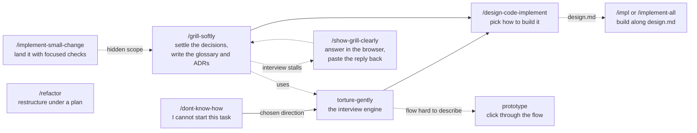

# GUOJIE-HONG Skills

**English** | [繁體中文](./README.zh-TW.md)

Ten agent skills for the stage *before* code is written and the first steps into it: finding a direction when you cannot start, interviewing along evidenced branches, choosing an implementation direction, implementing along it, landing each small change with proportionate validation, and refactoring under a plan.

They are built on top of [Matt Pocock's skills](https://github.com/mattpocock/skills) and extend that set rather than replace it. Seven of them call his skills, directly or indirectly, so install his set first (see [Prerequisite](#prerequisite-mattpocock-skills)).

Every skill follows one rule: **evidence, never guesswork**. Claims carry a locator (`path:line`, URL, document section, or a user statement), and anything not established is reported as unknown.

## Prerequisite: mattpocock-skills

Install [mattpocock-skills](https://github.com/mattpocock/skills) before this set. The dependencies are:

| This skill | Calls | From mattpocock-skills |
| --- | --- | --- |
| `torture-gently` (and `dont-know-how`, which calls it) | `prototype` | a clickable demo when words cannot make a flow's behaviour clear |
| `grill-softly` | `domain-modeling` | glossary and ADR writing during the interview |
| `impl`, `implement-all`, `refactor` | `tdd`, `code-review` | test-first work at the spec's seams, and the closing review |
| `implement-small-change` | `diagnosing-bugs` | hand-off when a "small" change turns out to have an uncertain cause |

The other two (`show-grill-clearly`, `design-code-implement`) run on their own.

## Install

Pick **one** route. Installing both leaves you with every skill twice.

### Claude Code plugin

This repo is its own single-plugin marketplace. It is not listed in Claude Code's official marketplace, so add the marketplace once, then install:

```text
/plugin marketplace add GUOJIE-HONG/skills
/plugin install guojie-skills@guojie-hong
```

From the terminal:

```bash
claude plugin marketplace add GUOJIE-HONG/skills
claude plugin install guojie-skills@guojie-hong
```

The plugin is a managed, read-only bundle. Pull new releases with:

```bash
claude plugin update guojie-skills@guojie-hong
```

### skills.sh (Claude Code, Codex, and other agents)

[skills.sh](https://skills.sh) copies the skill files into your project or home directory as ordinary files you own and can edit:

```bash
npx skills@latest add GUOJIE-HONG/skills
```

The installer lists the ten skills under the heading **Guojie Skills**. Take the ones you want, or one by name:

```bash
npx skills@latest add GUOJIE-HONG/skills --skill grill-softly
```

Nothing updates behind your back. Pull the latest with `npx skills update`.

## How the skills fit together



Every skill here is **user-invoked**: you type it, it orchestrates. The one exception is `torture-gently`, which is **model-invoked**: the agent may reach for it on its own when you ask to stress-test a plan, and `dont-know-how` and `grill-softly` call it as their interview engine.

You do not have to run the whole chain. Each skill accepts its input in whatever form it arrives (a file, a hand-off from the previous skill, or prose in the conversation) and stops at a clear boundary so the next step is your call. The one exception is `dont-know-how`, which goes straight into `torture-gently` once you pick a direction.

## The skills

### `/dont-know-how`

**Use it when** you face a task you cannot start: an unfamiliar system, protocol, library, or integration.

**What it does.** Scans the repo for what the project already owns that touches the task. Asks only for inaccessible information that could change a direction, its feasibility, or a material risk: counterpart documents, sample code, test environments, credential availability, and constraints. It asks how access is obtained, never for secret values. Then it gathers evidence itself, in order of authority (project dependencies, official sources, then community sources cross-checked against something official). It returns every real direction the evidence supports, without manufacturing extra ones, with each direction's evidence, strengths and weaknesses, fit, unknowns, and a recommendation.

**What it does not do.** Implement anything. Choosing is your decision.

**Hands off to** `torture-gently`: once you pick a direction, it interviews you on the details right away. Run `/grill-softly` instead if you also want a glossary and ADRs written.

### `/grill-softly`

**Use it when** you have a plan or design and want it sharpened, with the resulting vocabulary and decisions written down as you go.

**What it does.** Runs `torture-gently` and `domain-modeling` together. You get a bounded interview that only follows branches the repo or your sources show evidence for, and a glossary (`CONTEXT.md`) and ADRs that are updated the moment a term or decision crystallises.

**What it does not do.** Speculate. A branch without evidence does not get a question.

**Hands off to** `/design-code-implement` when the *what* is settled and the *how* is open.

### `torture-gently`

**Use it when** you want to stress-test your thinking without being dragged into hypothetical or out-of-scope questioning. This is the interview engine behind `dont-know-how` and `grill-softly`, and the only model-invoked skill in the set.

**What it does.** Maps the decision as a design tree and asks in rounds: every question whose prerequisites are settled goes into the current round, numbered, with a recommended answer. Before a question is asked it must clear a four-part gate: evidence, plausibility, materiality, and responsibility. Fact-finding is the agent's job; you are asked only for private information, preferences, and decisions. When a flow's behaviour is hard to put into words, it calls Matt's `prototype` for a clickable demo and asks against that. After each round it checkpoints changed decisions, blockers, parked branches, and the next frontier. Changing an upstream decision reopens every dependent conclusion, and a paused session returns a checkpoint that can be resumed without re-asking decisions whose premises still hold. The session ends only when no gated branch remains unvisited and every parked branch has been resolved, removed from scope, or explicitly accepted as open.

**What it does not do.** Act on the outcome until you confirm a shared understanding has been reached.

### `/show-grill-clearly`

**Use it when** a grilling session has left unresolved decisions that are easier to answer in a form than in chat, or that someone else has to answer.

**What it does.** Turns the open decisions into a self-contained HTML questionnaire in your temp directory and opens it in the browser. Each question keeps its original wording plus one scenario, up to three context facts, and two to four options, each stating its concrete cost. Prose is Traditional Chinese; technical text is preserved verbatim. When you are done, the page produces a reply prompt you paste back into the conversation. Builders are provided for Windows (PowerShell) and macOS (sh).

**What it does not do.** Discover facts, decide for you, or reopen a confirmed decision. Blank questions stay open.

### `/design-code-implement`

**Use it when** a spec already says *what* to build and you need to decide *how*, before any code is written.

**What it does.** Reads `CONTEXT.md`, relevant ADRs, the repo's instruction files, and any `to-tickets` tickets beside the spec, then sends at most five parallel sub-agents to map the repo's real architectural conventions in the areas the spec touches. Each finding names the existing convention, its evidence path, and where the new requirement is in tension with it. From those tensions it presents at least three directions: a conservative baseline that follows every convention, plus alternatives grown from the actual friction. Each direction states its positioning, footprint, cost, and the condition under which it is the wrong choice, and the list closes with a recommendation. The chosen direction is written to `design.md` next to the spec, containing only what will be done.

When the repo has no architecture to inherit (greenfield), the directions come from outside instead: project dependencies, then official docs and templates, then cross-checked community sources, each claim with its URL. The baseline is the official default for the stack. Each direction names the conventions it would establish, and the repo's instruction files still bind them. `design.md` then records the conventions the chosen direction sets.

**What it does not do.** Write production code, pad the list with contrived variants, or record rejected directions in `design.md`. If the conventions already determine the approach, it says so and stops. It recommends a direction, but the choice is yours.

### `/impl`

**Use it when** a spec or a few tickets are ready and you want them built in the current session along the direction in `design.md`.

**What it does.** Matt's `implement`, plus one read: `design.md` beside the spec (or under `.scratch/<feature-slug>/`). It works test-first at the seams the spec agreed on, typechecks and runs single test files as it goes, runs the full suite once, runs Matt's `code-review`, fixes what it finds, and commits to the current branch.

**What it does not do.** Choose a new direction. A `design.md` decision the code contradicts is raised with you.

### `/implement-all`

**Use it when** a whole spec with its tickets is ready and you want it built in parallel into one merge request.

**What it does.** Matt's `implement-spec`, with `design.md` among the pointers every implementer sub-agent reads. It works through the tickets in dependency order with implementer sub-agents in separate worktrees, merges each into one branch, fixes the findings of Matt's `code-review` in a single pass, and opens the merge request on whatever host `git remote -v` shows: a pull request on GitHub, a merge request on GitLab.

**What it does not do.** Choose a new direction. A `design.md` decision an implementer finds contradicted is reported back to you.

### `/implement-small-change`

**Use it when** you need a small bug fix, tweak, or feature landed with the smallest workflow that still proves the behavior.

**What it does.** Discovers the affected symbols and blast radius first, preferring a code knowledge graph or other repo-aware tool over plain search. Applies a scope gate: one clear behavior, understood callers, one module or seam, a focused check that can detect it, easy to reverse. Makes the smallest coherent change, runs the narrowest checks that could catch a mistake, and reports the observable result, the files touched, the exact validation run, and what was deliberately not run.

**What it does not do.** Classify a change as small by file count, run the full suite by default, or commit unless asked. When a hard stop appears (a cross-layer decision, a public contract, security or payments, a new domain term, or ambiguous interpretations) it pauses, writes an impact brief, and asks you to run `/grill-softly` with it. When the cause is uncertain rather than ambiguous, it hands off to `diagnosing-bugs`.

### `/refactor`

**Use it when** you want existing code restructured, whether the behavior must stay exactly the same or is meant to change along the way.

**What it does.** Reads the code and its callers, then classifies the request: behavior-preserving (every observable result stays the same) or behavior-changing, and whether a change is breaking. A request that mixes both is split into two passes, the behavior-preserving one first. It writes a plan to `.refactor/<refactor-slug>/plan.md` with the goal, scope, current test coverage and its gaps, and small steps that each leave the code working. A behavior-preserving pass runs the existing tests on the untouched code as a green baseline, adds characterization tests for the gaps, and reruns the same tests after every step. A behavior-changing pass goes test-first with Matt's `tdd`. Both close with Matt's `code-review` against the plan, then report the tests run, the review findings, and every deviation from the plan.

**What it does not do.** Edit before you approve the plan of a breaking change. Change the assertions of the baseline tests on a behavior-preserving pass. Carry on when the code contradicts the plan: it stops and updates the plan with you first.

### `/ptns`

**Use it when** you want a fresh session to pick up the current progress.

**What it does.** Writes the progress as one short handoff prompt that opens with the working directory the next session should be in. On Claude Code it lists the sessions it can reach, asks which one should take over, and sends the prompt only after you pick; on other agents (Codex, ...) it returns one copyable block.

## Deprecated

`to-tasks` and `implement-task` live in [`deprecated/`](./deprecated) for reference. Neither the plugin nor `npx skills` installs them. They split tickets into two-project tasks for small models, which did not lower the error rate on cross-project work in practice; implement tickets with `/impl` or `/implement-all` instead.

## Versioning

The `version` field in [.claude-plugin/plugin.json](./.claude-plugin/plugin.json) is what Claude Code uses to decide that installed users have an update. It is bumped by hand on release, and each release gets a line in [CHANGELOG.md](./CHANGELOG.md).

## License

[MIT](./LICENSE)
