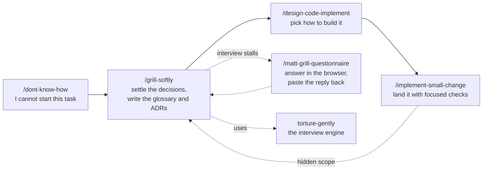

# GUOJIE526 Skills

**English** | [繁體中文](./README.zh-TW.md)

Six agent skills for the stage *before* code is written: finding a direction when you cannot start, interviewing along evidenced branches, choosing an implementation direction, and landing a small change with proportionate validation.

They are built on top of [Matt Pocock's skills](https://github.com/mattpocock/skills) and extend that set rather than replace it. Three of them call his skills directly, so install his set first (see [Prerequisite](#prerequisite-mattpocock-skills)).

Every skill follows one rule: **evidence, never guesswork**. Claims carry a locator (`path:line`, URL, document section, or a user statement), and anything not established is reported as unknown.

## Prerequisite: mattpocock-skills

Install [mattpocock-skills](https://github.com/mattpocock/skills) before this set. The dependencies are:

| This skill | Calls | From mattpocock-skills |
| --- | --- | --- |
| `grill-softly` | `domain-modeling` | glossary and ADR writing during the interview |
| `implement-small-change` | `grill-with-docs`, `diagnosing-bugs` | hand-off when a "small" change turns out to have hidden scope or an uncertain cause |
| `matt-grill-questionnaire` | a grilling session's decision set | the questionnaire is built from unresolved questions of a Matt-style grill |

The other three (`dont-know-how`, `torture-gently`, `design-code-implement`) run on their own.

## Install

Pick **one** route. Installing both leaves you with every skill twice.

### Claude Code plugin

This repo is its own single-plugin marketplace. It is not listed in Claude Code's official marketplace, so add the marketplace once, then install:

```
/plugin marketplace add GUOJIE526/skills
/plugin install guojie-skills@guojie526
```

From the terminal:

```bash
claude plugin marketplace add GUOJIE526/skills
claude plugin install guojie-skills@guojie526
```

The plugin is a managed, read-only bundle. Pull new releases with:

```bash
claude plugin update guojie-skills@guojie526
```

### skills.sh (Claude Code, Codex, and other agents)

[skills.sh](https://skills.sh) copies the skill files into your project or home directory as ordinary files you own and can edit:

```bash
npx skills@latest add GUOJIE526/skills
```

The installer lists the six skills under the heading **Guojie Skills**. Take the ones you want, or one by name:

```bash
npx skills@latest add GUOJIE526/skills --skill grill-softly
```

Nothing updates behind your back. Pull the latest with `npx skills update`.

## How the skills fit together



Every skill here is **user-invoked**: you type it, it orchestrates. The one exception is `torture-gently`, which is **model-invoked**: the agent may reach for it on its own when you ask to stress-test a plan, and `grill-softly` calls it as its interview engine.

You do not have to run the whole chain. Each skill accepts its input in whatever form it arrives (a file, a hand-off from the previous skill, or prose in the conversation) and stops at a clear boundary so the next step is your call.

## The skills

### `/dont-know-how`

**Use it when** you face a task you cannot start: an unfamiliar system, protocol, library, or integration.

**What it does.** Scans the repo for what the project already owns that touches the task. Asks you only for what search cannot reach: counterpart documents, sample code, test environments, credentials, constraints. Then gathers evidence itself, in order of authority (project dependencies, official sources, then community sources cross-checked against something official). Returns at least three directions, each with its evidence, strengths and weaknesses, when it fits, and what remains unconfirmed, and closes with a recommendation.

**What it does not do.** Implement anything. Choosing is your decision.

**Hands off to** `/grill-softly` once you have picked a direction and need to settle the details.

### `/grill-softly`

**Use it when** you have a plan or design and want it sharpened, with the resulting vocabulary and decisions written down as you go.

**What it does.** Runs `torture-gently` and `domain-modeling` together. You get a bounded interview that only follows branches the repo or your sources show evidence for, and a glossary (`CONTEXT.md`) and ADRs that are updated the moment a term or decision crystallises.

**What it does not do.** Speculate. A branch without evidence does not get a question.

**Hands off to** `/design-code-implement` when the *what* is settled and the *how* is open.

### `torture-gently`

**Use it when** you want to stress-test your thinking without being dragged into hypothetical or out-of-scope questioning. This is the interview engine behind `grill-softly`, and the only model-invoked skill in the set.

**What it does.** Maps the decision as a design tree and asks in rounds: every question whose prerequisites are settled goes into the current round, numbered, with a recommended answer. Before a question is asked it must clear a four-part gate: evidence, plausibility, materiality, and responsibility. Fact-finding is the agent's job; you are asked only for private information, preferences, and decisions. The session ends when no gated branch remains unvisited.

**What it does not do.** Act on the outcome until you confirm a shared understanding has been reached.

### `/matt-grill-questionnaire`

**Use it when** a grilling session has left unresolved decisions that are easier to answer in a form than in chat, or that someone else has to answer.

**What it does.** Turns the open decisions into a self-contained HTML questionnaire in your temp directory and opens it in the browser. Each question keeps its original wording plus one scenario, up to three context facts, and two to four options, each stating its concrete cost. Prose is Traditional Chinese; technical text is preserved verbatim. When you are done, the page produces a reply prompt you paste back into the conversation. Builders are provided for Windows (PowerShell) and macOS (sh).

**What it does not do.** Discover facts, decide for you, or reopen a confirmed decision. Blank questions stay open.

### `/design-code-implement`

**Use it when** a spec already says *what* to build and you need to decide *how*, before any code is written.

**What it does.** Reads `CONTEXT.md` and relevant ADRs, then sends at most five parallel sub-agents to map the repo's real architectural conventions in the areas the spec touches. Each finding names the existing convention, its evidence path, and where the new requirement is in tension with it. From those tensions it presents at least three directions: a conservative baseline that follows every convention, plus alternatives grown from the actual friction. Each direction states its positioning, footprint, cost, and the condition under which it is the wrong choice. The chosen direction is written to `design.md` next to the spec, in Traditional Chinese, containing only what will be done.

**What it does not do.** Write production code, pad the list with contrived variants, or record rejected directions in `design.md`. If the conventions already determine the approach, it says so and points you to `/implement-small-change`.

**Hands off to** `/implement-small-change` for a bounded change, or Matt's `/implement` for a larger one.

### `/implement-small-change`

**Use it when** you need a small bug fix, tweak, or feature landed with the smallest workflow that still proves the behavior.

**What it does.** Discovers the affected symbols and blast radius first, preferring a code knowledge graph or other repo-aware tool over plain search. Applies a scope gate: one clear behavior, understood callers, one module or seam, a focused check that can detect it, easy to reverse. Makes the smallest coherent change, runs the narrowest checks that could catch a mistake, and reports the observable result, the files touched, the exact validation run, and what was deliberately not run.

**What it does not do.** Classify a change as small by file count, run the full suite by default, or commit unless asked. When a hard stop appears (a cross-layer decision, a public contract, security or payments, a new domain term, or ambiguous interpretations) it pauses and hands off to Matt's `grill-with-docs`. When the cause is uncertain rather than ambiguous, it hands off to `diagnosing-bugs`.

## Versioning

The `version` field in [.claude-plugin/plugin.json](./.claude-plugin/plugin.json) is what Claude Code uses to decide that installed users have an update. It is bumped by hand on release, and each release gets a line in [CHANGELOG.md](./CHANGELOG.md).

## License

[MIT](./LICENSE)
