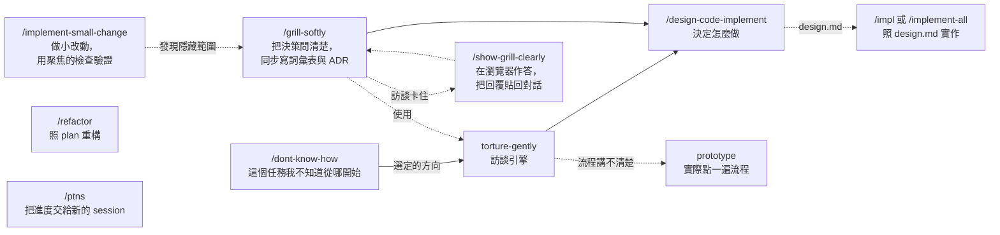

# GUOJIE-HONG Skills

[English](./README.md) | **繁體中文**

這裡放的是我平常在用的 agent skill。它們大多用在還沒動手寫程式的時候：不知道從哪下手、需求還沒問清楚、做法還沒選定，或是改動很小，但不想憑感覺動手。也有幾個會直接動手：照 `design.md` 把 spec 做出來、照 plan 重構既有程式碼。

它們長在 [Matt Pocock 的 skills](https://github.com/mattpocock/skills) 上面。我沒有重做他已經做好的東西，很多 skill 會直接呼叫他的。

共通的脾氣只有一個：每句話要有出處。`path:line`、URL、文件章節，或是你自己說過的話都算。查不到的事會直接告訴你查不到，不會編一個看起來合理的答案填上去。

## 前置需求

先裝 [mattpocock-skills](https://github.com/mattpocock/skills)，再裝這套。沒裝的話，會呼叫他 skill 的那幾個跑不起來。

## 安裝

兩條路線挑一條就好。兩條都裝，每個 skill 會出現兩份。

### Claude Code plugin

這個 repo 本身就是一個 plugin marketplace，裡面只有一個 plugin。它沒有上架到 Claude Code 官方的 marketplace，所以要先加入這個 marketplace 再安裝：

```text
/plugin marketplace add GUOJIE-HONG/skills
/plugin install guojie-skills@guojie-hong
```

在終端機的話：

```bash
claude plugin marketplace add GUOJIE-HONG/skills
claude plugin install guojie-skills@guojie-hong
```

plugin 是唯讀的，由 Claude Code 管理。要更新：

```bash
claude plugin update guojie-skills@guojie-hong
```

### skills.sh（Claude Code、Codex 與其他 agent）

[skills.sh](https://skills.sh) 會把檔案複製到你的專案或家目錄，之後那些檔案是你的，想改就改：

```bash
npx skills@latest add GUOJIE-HONG/skills
```

安裝器會在 **Guojie Skills** 底下列出所有 skill，勾你要的。只要一個也行：

```bash
npx skills@latest add GUOJIE-HONG/skills --skill grill-softly
```

檔案不會自己更新。想拉新版就跑 `npx skills update`。

## 這些 skill 怎麼接在一起



只有 `torture-gently` 不一定要你打指令：你說「幫我壓力測試這個計畫」時，agent 可能自己拿來用，`dont-know-how` 和 `grill-softly` 也把它當引擎呼叫。其他都要你自己打指令才會動。

不用整條鏈跑完。每個 skill 都接得住上一步丟過來的東西，不管是檔案、交接內容，還是你在對話裡打的一段話。做完自己的那段它就停，下一步是你的事。唯一的例外是 `dont-know-how`：你選定方向後，它會直接接 `torture-gently` 往下問。

## 已棄用

`to-tasks` 和 `implement-task` 放在 [`deprecated/`](./deprecated) 留作參考，plugin 和 `npx skills` 都不會安裝。它們把 ticket 切成兩個專案內的 task 交給小模型做，實測跨專案實作的錯誤率沒有下降；ticket 改交給 `/impl` 或 `/implement-all` 實作。

## 版本

[.claude-plugin/plugin.json](./.claude-plugin/plugin.json) 裡的 `version` 是 Claude Code 判斷有沒有新版的依據。發版時手動改，並在 [CHANGELOG.md](./CHANGELOG.md) 加一行。

## 授權

[MIT](./LICENSE)
