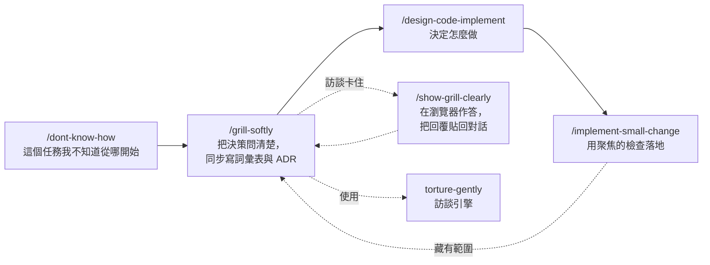

# GUOJIE-HONG Skills

[English](./README.md) | **繁體中文**

六個給 agent 用的 skill，鎖定「寫程式之前」那一段：不知道從哪開始時找方向、沿著有證據的分枝訪談、選定實作方向、以及用相稱的驗證把一個小改動落地。

這套 skill 建立在 [Matt Pocock 的 skills](https://github.com/mattpocock/skills) 之上，是延伸而不是取代。其中兩個會直接呼叫他的 skill，所以請先安裝他那一套（見[前置需求](#前置需求mattpocock-skills)）。

所有 skill 都遵守同一條規則：**只講證據，不猜**。每個主張都附定位（`path:line`、URL、文件章節或使用者的陳述），查不到的事就明說是未知。

## 前置需求：mattpocock-skills

安裝這套之前，請先裝好 [mattpocock-skills](https://github.com/mattpocock/skills)。依賴關係如下：

| 本套 skill | 呼叫 | 來自 mattpocock-skills |
| --- | --- | --- |
| `grill-softly` | `domain-modeling` | 訪談過程中同步寫詞彙表與 ADR |
| `implement-small-change` | `grill-with-docs`、`diagnosing-bugs` | 「小改動」其實藏有範圍、或原因不明時的交接 |

另外四個（`dont-know-how`、`torture-gently`、`show-grill-clearly`、`design-code-implement`）可獨立運作。

## 安裝

兩條路線**擇一**。兩條都裝會讓每個 skill 出現兩份。

### Claude Code plugin

這個 repo 本身就是一個單一 plugin 的市集。它沒有上 Claude Code 的官方市集，所以先加一次市集，再安裝：

```text
/plugin marketplace add GUOJIE-HONG/skills
/plugin install guojie-skills@guojie-hong
```

在終端機執行：

```bash
claude plugin marketplace add GUOJIE-HONG/skills
claude plugin install guojie-skills@guojie-hong
```

plugin 是唯讀、由 Claude Code 管理的套件。要拿新版本：

```bash
claude plugin update guojie-skills@guojie-hong
```

### skills.sh（Claude Code、Codex 與其他 agent）

[skills.sh](https://skills.sh) 會把 skill 檔案複製到你的專案或家目錄，成為你可以自行修改的一般檔案：

```bash
npx skills@latest add GUOJIE-HONG/skills
```

安裝器會在 **Guojie Skills** 標題下列出六個 skill，勾你要的即可；也可以指名只裝一個：

```bash
npx skills@latest add GUOJIE-HONG/skills --skill grill-softly
```

檔案不會在你不知情時被更新。要拉最新版就執行 `npx skills update`。

## 這些 skill 怎麼銜接



這裡的 skill 幾乎都是**使用者呼叫**：你打指令，它負責編排。唯一例外是 `torture-gently`，它是**模型可呼叫**：你要求壓力測試某個計畫時，agent 可以自己拿來用；`grill-softly` 也把它當訪談引擎呼叫。

不一定要整條鏈都跑。每個 skill 都接受任何形式的輸入（檔案、上一個 skill 的交接、或對話裡的文字），並在明確的邊界停下來，下一步由你決定。

## 各 skill 說明

### `/dont-know-how`

**什麼時候用**：面對一個不知道怎麼開始的任務，例如不熟的系統、協定、函式庫或整合。

**它做什麼**。先掃描 repo，找出專案裡已經有哪些東西跟這個任務相關。只問你搜尋碰不到的東西：對方提供的文件、範例程式、測試環境、憑證、限制條件。然後自己蒐證，依權威順序進行：專案相依套件、官方來源、最後才是社群來源，而且社群來源必須跟官方來源交叉比對。最後回覆至少三個方向，每個附證據、優缺點、適用情境、還有哪些點沒確認，並給出建議。

**它不做什麼**。不實作。選哪個方向是你的決定。

**交接給** `/grill-softly`：方向選定後，用它把細節問清楚。

### `/grill-softly`

**什麼時候用**：手上有一份計畫或設計，想把它磨得更精確，並且把過程中確定的名詞與決策當場寫下來。

**它做什麼**。同時執行 `torture-gently` 與 `domain-modeling`。你會得到一場有邊界的訪談，只走 repo 或你提供的來源有證據支撐的分枝；名詞或決策一確定，詞彙表（`CONTEXT.md`）與 ADR 就立刻更新。

**它不做什麼**。不臆測。沒有證據的分枝不會變成問題。

**交接給** `/design-code-implement`：「做什麼」定了、「怎麼做」還開著的時候。

### `torture-gently`

**什麼時候用**：想壓力測試自己的想法，又不想被拖進假設性或超出範圍的追問。它是 `grill-softly` 背後的訪談引擎，也是這套裡唯一模型可呼叫的 skill。

**它做什麼**。把決策畫成一棵設計樹，分回合提問：前提都已確定的問題全部放進當前回合，逐題編號並附建議答案。每個問題在提出前都要過四道門：有證據、有可能發生、答案會改變決策、屬於討論對象的責任範圍。查事實是 agent 的工作；只會問你私有資訊、偏好與決定。所有過門的分枝都走完，訪談才結束。

**它不做什麼**。在你確認雙方已達成共識之前，不會照結論動手。

### `/show-grill-clearly`

**什麼時候用**：一場 grill 留下了未決的問題，用表單作答比在對話裡回答方便，或是必須由別人來回答。

**它做什麼**。把未決問題做成一份獨立的 HTML 問卷，放在暫存目錄並用瀏覽器打開。每題保留原始問法，另附一個情境、最多三個脈絡事實、二到四個選項，每個選項都寫明具體代價。說明文字用繁體中文，技術文字原樣保留。作答完成後，頁面會產生一段回覆 prompt，貼回原本的對話即可。提供 Windows（PowerShell）與 macOS（sh）兩種建置腳本。

**它不做什麼**。不查事實、不替你決定、不重開已確認的決策。沒作答的題目維持未決。

**交接回** 原本的 grill：貼回回覆後，由它繼續。

### `/design-code-implement`

**什麼時候用**：規格已經說了要做「什麼」，需要在動手寫程式前決定「怎麼做」。

**它做什麼**。先讀 `CONTEXT.md` 與相關 ADR，再派最多五個平行 sub-agent，在規格觸及的範圍內把 repo 真正的架構慣例摸清楚。每項發現都寫明現有慣例、證據路徑、以及新需求跟慣例衝突的地方。從這些衝突點提出至少三個方向：一個完全遵循現有慣例的保守基線，加上由實際摩擦長出來的替代方案。每個方向都寫明定位、觸及範圍、代價、以及在什麼條件下選它會是錯的。選定的方向寫進規格旁的 `design.md`，用繁體中文，只寫會做的事。

**它不做什麼**。不寫產品程式碼，不硬湊方向充數，不把被否決的方向寫進 `design.md`。如果現有慣例已經決定了做法，它會直說，並指向 `/implement-small-change`。

**交接給** `/implement-small-change`（範圍有限的改動）或 Matt 的 `/implement`（較大的工作）。

### `/implement-small-change`

**什麼時候用**：要落地一個小型 bug 修正、微調或功能，用最小的流程仍能證明行為正確。

**它做什麼**。先找出受影響的符號與影響範圍，優先用程式碼知識圖或其他認識 repo 的工具，而不是純文字搜尋。套用範圍門檻：行為單一明確、呼叫端都清楚、限於一個模組或既有接縫、有一個聚焦的檢查能偵測、容易回復。做最小的完整改動，跑最窄但能抓到錯的檢查，最後回報可觀察的結果、改了哪些檔案、跑了哪些驗證、以及刻意沒跑什麼。

**它不做什麼**。不用檔案數判斷改動大小，預設不跑完整測試，未被要求不 commit。遇到硬性停止條件（跨層決策、公開契約、安全或金流、新的領域名詞、多種解讀）就暫停並交接給 Matt 的 `grill-with-docs`；原因不明而非解讀不明時，交接給 `diagnosing-bugs`。

## 版本

[.claude-plugin/plugin.json](./.claude-plugin/plugin.json) 的 `version` 欄位是 Claude Code 判斷已安裝使用者有沒有新版的依據。發版時手動調升，並在 [CHANGELOG.md](./CHANGELOG.md) 加一行。

## 授權

[MIT](./LICENSE)
