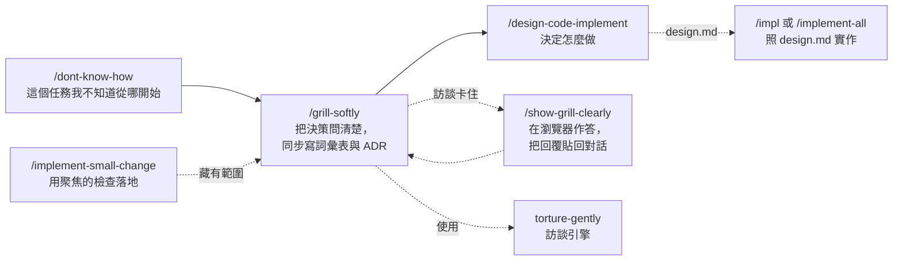

# GUOJIE-HONG Skills

[English](./README.md) | **繁體中文**

這裡放的是我平常在用的九個 agent skill。它們大多管同一段時間：程式碼還沒開始寫的時候。不知道從哪下手、需求還沒問清楚、做法還沒選定、或是改動很小但不想憑感覺動手，這幾個 skill 就是為這些場面寫的。另外兩個往前多走一步：照 `design.md` 選定的方向把 spec 做出來。

它們長在 [Matt Pocock 的 skills](https://github.com/mattpocock/skills) 上面。我沒有重做他已經做好的東西，有四個 skill 會直接呼叫他的，所以請先裝他那套，見下方[前置需求](#前置需求mattpocock-skills)。

共通的脾氣只有一個：每句話要有出處。`path:line`、URL、文件章節，或是你自己說過的話都算。查不到的事會直接告訴你查不到，不會編一個看起來合理的答案填上去。

## 前置需求：mattpocock-skills

先裝 [mattpocock-skills](https://github.com/mattpocock/skills)，再裝這套。用到他 skill 的地方如下：

| 本套 skill | 呼叫 | 用在哪 |
| --- | --- | --- |
| `grill-softly` | `domain-modeling` | 訪談時同步寫詞彙表與 ADR |
| `impl`、`implement-all` | `tdd`、`code-review` | 在 spec 講好的接縫先寫測試，以及收尾的 review |
| `implement-small-change` | `grill-with-docs`、`diagnosing-bugs` | 「小改動」其實藏有範圍，或原因查不出來時的交接 |

另外四個（`dont-know-how`、`torture-gently`、`show-grill-clearly`、`design-code-implement`）沒裝他的也能跑。

## 安裝

兩條路線挑一條就好。兩條都裝，每個 skill 會出現兩份。

### Claude Code plugin

這個 repo 自己就是一個只有一個 plugin 的市集。它沒有上 Claude Code 官方市集，所以要先加市集，再安裝：

```text
/plugin marketplace add GUOJIE-HONG/skills
/plugin install guojie-skills@guojie-hong
```

在終端機的話：

```bash
claude plugin marketplace add GUOJIE-HONG/skills
claude plugin install guojie-skills@guojie-hong
```

plugin 是唯讀的，由 Claude Code 管理。要更新：

```bash
claude plugin update guojie-skills@guojie-hong
```

### skills.sh（Claude Code、Codex 與其他 agent）

[skills.sh](https://skills.sh) 會把檔案複製到你的專案或家目錄，之後那些檔案是你的，想改就改：

```bash
npx skills@latest add GUOJIE-HONG/skills
```

安裝器會在 **Guojie Skills** 底下列出九個 skill，勾你要的。只要一個也行：

```bash
npx skills@latest add GUOJIE-HONG/skills --skill grill-softly
```

檔案不會自己更新。想拉新版就跑 `npx skills update`。

## 這些 skill 怎麼接在一起



除了 `torture-gently`，其他八個都要你自己打指令才會動。`torture-gently` 是例外，你說「幫我壓力測試這個計畫」時 agent 可能自己拿來用，`grill-softly` 也把它當引擎在呼叫。

不用整條鏈跑完。每個 skill 都接得住上一步丟過來的東西，不管是檔案、交接內容，還是你在對話裡打的一段話。做完自己的那段它就停，下一步是你的事。

## 各 skill 說明

### `/dont-know-how`

有時候任務丟過來，你連第一步要幹嘛都不知道。不熟的系統、沒碰過的協定、一個沒用過的套件，或是要跟別人的服務串接。這個 skill 就是給那個時刻用的。

它會先翻 repo，看專案裡有沒有已經跟這件事沾上邊的東西。接著只問搜尋找不到、而且答案真的會改變方向、可行性或重大風險的問題，例如對方文件、範例程式、測試環境、存取資格和限制。它只問存取資格是否存在、怎麼申請、由誰管理，不會要你把密碼、API key、private key、token 或憑證秘密貼進對話。接著它自己去查，順序是專案已裝的套件、官方文件、最後才是社群來源，而且社群來源要跟官方的對過才算。

最後你會拿到證據真正支持的所有方向：通常至少三個，但如果只有一到兩個可信方向，它會直接說明為什麼再加一個只是硬湊。每個方向都附證據、優缺點、適合什麼情況、還有哪些點沒確認。它會給建議，但不會替你選，也不會開始做。選定方向後，下一步通常是 `/grill-softly`。

### `/grill-softly`

手上有一份計畫或設計，想把它磨到能動手的程度，順便把過程裡冒出來的名詞和決定寫下來，用這個。

它其實是把 `torture-gently` 和 Matt 的 `domain-modeling` 綁在一起跑。訪談的部分只走有證據的分枝，repo 裡沒有、你也沒提過的東西不會變成問題。詞彙表（`CONTEXT.md`）和 ADR 是在訪談當中寫的，不是結束後補。

「做什麼」問定了、「怎麼做」還開著，就交給 `/design-code-implement`。

### `torture-gently`

這是 `grill-softly` 背後的訪談引擎，也可以單獨用。名字的意思是：折磨你，但溫柔一點。它不會拖你去回答假設性的問題，也不會問超出討論範圍的事。

做法是把決策畫成一棵樹，分回合問。前提都確定了的問題會一次全部丟出來，逐題編號，每題附建議答案。一個問題要進回合，得先過四道門：有證據、有可能發生、答案會改變某個決定、屬於這件事的責任範圍。四道門任一沒過，就不問。

查事實是它的工作，不是你的。它只會問你三類東西：只有你知道的資訊、你的偏好、你的決定。每輪回答後，它只列出這輪改變的決策、阻塞事實、暫放分枝和下一輪問題；上游決策一改，依賴它的下游結論會全部重新打開。中途暫停時會留下可以接著走的 checkpoint，不會重問前提仍成立的決定。所有該問的問完，而且沒有未被接受的暫放分枝後，它才會停下來等你確認雙方理解一致，確認之前不動手。

### `/show-grill-clearly`

訪談問到一半，有幾題在對話裡怎麼看都看不清楚，或者答案得由別人給。這時候把問題搬到瀏覽器裡比較好處理。

它會產生一份獨立的 HTML 問卷放在暫存目錄，然後打開。每題保留原本的問法，另外加一個具體情境、最多三個脈絡事實、二到四個選項。每個選項底下都寫著選了會怎樣。說明文字是繁體中文，技術文字原樣照抄。答完按「整理回復 prompt」，把產生的內容貼回對話，訪談就接著走。

它不查事實，不替你決定，也不會把已經確認的決定重新打開。沒答的題目就維持沒答。建置腳本有 Windows（PowerShell）和 macOS（sh）兩個版本。

### `/design-code-implement`

規格已經說了要做什麼，但還沒決定怎麼做。這個 skill 卡在那個位置，動手寫程式之前。

它先讀 `CONTEXT.md`、相關的 ADR、repo 的指示檔，以及規格旁的 `to-tickets` ticket，然後派最多五個 sub-agent 平行去看 repo 在規格觸及的地方實際上怎麼做事：層怎麼切、錯誤怎麼往上傳、資料從哪進從哪出、測試放哪。每個 sub-agent 回報三樣東西：現有慣例、證據路徑、以及新需求跟慣例撞在哪。撞的地方才是重點，沒撞的只是背景。

從那些撞點它會給至少三個方向。第一個永遠是保守基線，完全照現有慣例做，不開新接縫。另外的方向從實際摩擦長出來，不是套模板。每個方向都寫四樣：定位、會碰哪些檔案和接縫、代價、以及在什麼條件下選它是錯的。最後一項是強制的，一個方向如果講不出什麼時候不該選它，就是還沒想清楚。列完後會給一個建議方向，但選擇還是你的。

如果 repo 裡沒有架構可以繼承（從 0 開始），方向改從外部來源長出來：先看專案相依套件，再看官方文件和官方樣板，最後才是交叉確認過的社群資料，每個說法都附 URL。基線改成官方對這個技術棧的預設做法。每個方向要寫出它會訂下的慣例，而 repo 指示檔裡的規則照樣要遵守。

選定後寫進規格旁邊的 `design.md`，只寫要做的事；從 0 開始的話，也寫進選定方向訂下的慣例。被否決的方向和理由不寫，因為下游讀這份檔案的 agent 會把它當指令，寫了不做的方案等於邀請它去做。

如果 repo 的慣例已經把做法定死，湊不出三個真的方向，它會直說並停下，不會硬湊。它自己不寫產品程式碼，也不推薦要用什麼方式實作，那是你的決定。

### `/impl`

spec 或幾張 ticket 準備好了，想在目前這個 session 照 `design.md` 的方向做出來。用這個。

它就是 Matt 的 `implement`，多讀一份 `design.md`（在 spec 旁邊，或 `.scratch/<feature-slug>/` 底下）。在 spec 講好的接縫先寫測試，邊做邊跑型別檢查和單一測試檔，最後跑一次整套測試，再跑 `$code-review` 並修掉發現的問題，commit 到目前的分支。

它不會自己換方向。程式碼跟 `design.md` 的決定對不上時，它會提出來問你。

### `/implement-all`

整份 spec 和它的 ticket 都準備好了，想並行做完、收成一個合併請求。用這個。

它就是 Matt 的 `implement-spec`，但每個實作 sub-agent 拿到的指引裡多了 `design.md`。它照 ticket 的 frontier 派 sub-agent 在各自的 worktree 實作，逐一合進同一個分支，`$code-review` 的發現交給一個 sub-agent 一次修完，最後在 `git remote -v` 顯示的平台開合併請求：GitHub 開 PR，GitLab 開 MR。

它不會自己換方向。實作時發現 `design.md` 的決定跟程式碼對不上，會回報給你。

### `/implement-small-change`

小 bug、小調整、小功能。改動不大，但你還是想要一個能證明它真的對了的流程，而不是改完看起來沒事就算了。

它先找出受影響的符號和影響範圍，有程式碼知識圖就先用，沒有再退回一般搜尋。然後過一道範圍門檻：行為單一明確、呼叫端都清楚、限於一個模組或既有接縫、有一個聚焦的檢查能抓到、容易回復。全過才走快車道。

改動本身盡量小。修 bug 的話先重現症狀再改。跑的檢查也挑最窄但抓得到錯的那個，預設不跑整套測試。最後回報你看得到的結果、改了哪些檔案、跑了什麼驗證，以及刻意沒跑什麼和為什麼。

它不用檔案數判斷大小，一行改到共用契約也可能很大。碰到跨層決策、公開 API、安全或金流、新的領域名詞、或同一句話有幾種解讀，它會停下來交給 Matt 的 `grill-with-docs`。如果問題是原因查不出來而不是意思不清楚，交給 `diagnosing-bugs`。沒叫它 commit 它不會 commit。

## 已棄用

`to-tasks` 和 `implement-task` 放在 [`deprecated/`](./deprecated) 留作參考，plugin 和 `npx skills` 都不會安裝。它們把 ticket 切成兩個專案內的 task 交給小模型做，實測跨專案實作的錯誤率沒有下降；ticket 改交給 `/impl` 或 `/implement-all` 實作。

## 版本

[.claude-plugin/plugin.json](./.claude-plugin/plugin.json) 裡的 `version` 是 Claude Code 判斷有沒有新版的依據。發版時手動改，並在 [CHANGELOG.md](./CHANGELOG.md) 加一行。

## 授權

[MIT](./LICENSE)
