# design.md template

Fill every section the chosen direction needs and drop the rest. `<...>` marks what to replace.

````markdown
# <feature> design

## Flows

### Flow 1: <what triggers it>

```text
1. <step in plain words>
   ↳ <function()> · <path/to/file>
   │
   ▼
2. <step>
   ↳ <function()> · <path/to/file>
   │
   ▼
3. In parallel:
   ├─ 3a. <step>
   │      ↳ <function()> · <path/to/file>
   └─ 3b. <step> → Flow 2
          ↳ <function()> · <path/to/file>
```

Failures:

- Step 2 fails (<condition>) → <what happens>

### Flow 2: <step 3b expanded>

...

## States

```mermaid
stateDiagram-v2
    [*] --> <State>
    <State> --> <State>: <event>
```

### <entity>



## Other changes

- <migration, configuration, or interface shape>

## Conventions

- <convention> — `<path/to/file:line>`
````
